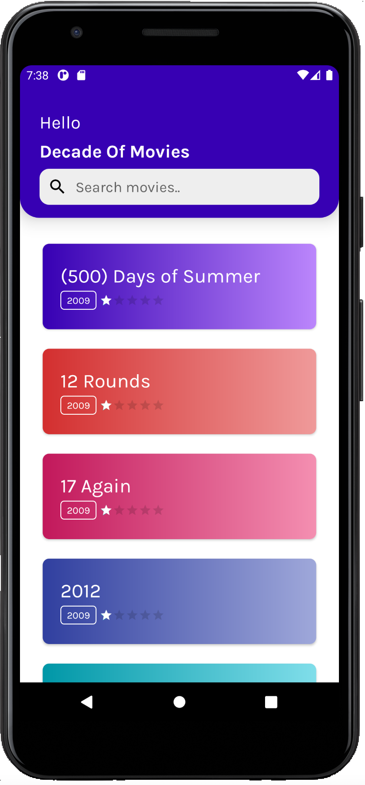
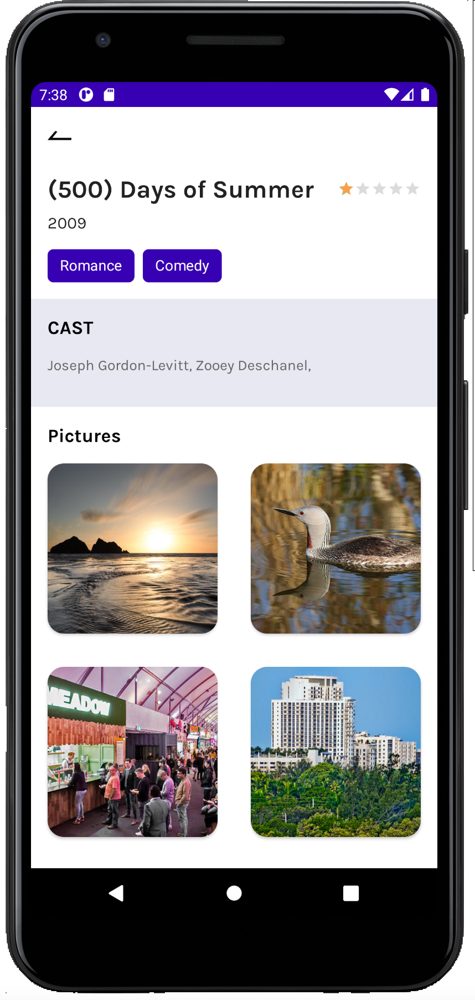

# Movie App

  
  
   

Demo Application to understand the architecture of MVVM App with Unit tests

## Build Instructions ##

The [gradle build system](http://tools.android.com/tech-docs/new-build-system/user-guide) will fetch all dependencies and generate
files you need to build the project. After this select device and run it.

You can use [Android Studio](http://developer.android.com/sdk/installing/studio.html) by importing the project as a Gradle project.

## Directory structure ##

    `|-- base                            # base module (contains providers and streamer)
     |    |-- build.gradle               # base build script
     |    `-- src
     |          |-- main
     |                |-- assets         # base module assets
     |                |-- java           # base module kotlin code
     |                `-- res            # base module resources

## Versioning

For transparency and insight into our release cycle, and for striving to maintain backward compatibility, Movie App will be maintained according to the [Semantic Versioning](http://semver.org/) guidelines as much as possible.

