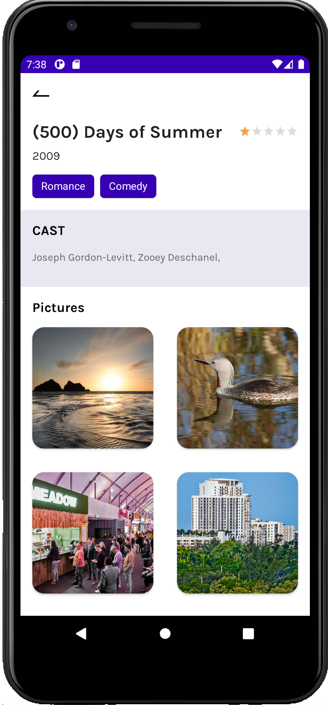

# Decade of Movies App

  
  
   

Demo Application to understand the architecture of MVVM App with Unit tests

## Build Instructions ##

The [gradle build system](http://tools.android.com/tech-docs/new-build-system/user-guide) will fetch all dependencies and generate
files you need to build the project. After this select device and run it.

You can use [Android Studio](http://developer.android.com/sdk/installing/studio.html) by importing the project as a Gradle project.

## Directory structure ##

    `|-- base                            # base module (contains providers and streamer)
     |    |-- build.gradle               # base build script
     |    `-- src
     |          |-- main
     |                |-- assets         # base module assets
     |                |-- java           # base module kotlin code
     |                `-- res            # base module resources

## Features :

- Using MVVM (Model-View-ViewModel) Architecture
- Using Room Persistence for local database
- Using Koin for Dependency Injection (ViewModels, WebService and Preferences)
- Using Retrofit to request api network
- Using JUnit4 with Mockito to write Unit tests
- Using Glide for loading image from url
- Using RxJava3 for Threading

## Dependencies :

- [Lifecycle & Livedata](https://developer.android.com/jetpack/androidx/releases/lifecycle)
- [Navigation Component](https://developer.android.com/jetpack/androidx/releases/navigation)
- [Retrofit 2](https://square.github.io/retrofit/)
- [RxJava3](https://github.com/ReactiveX/RxAndroid)
- [Glide](https://github.com/bumptech/glide)
- [Koin](https://github.com/InsertKoinIO/koin)
- [AndroidX](https://mvnrepository.com/artifact/androidx)

## Author

[**M Nouman**](https://www.linkedin.com/in/chnouman/)